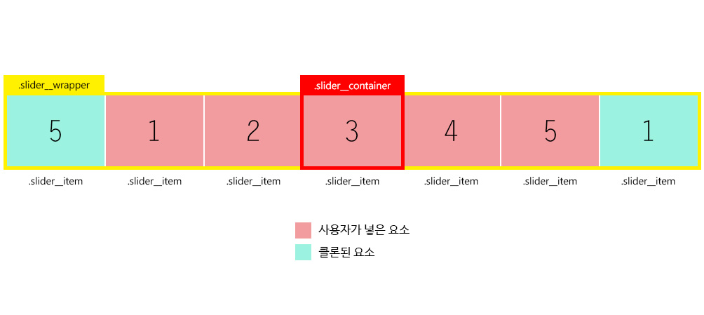

# Carousel Slider API

## - HTML Layout

<div class="user-slider">
    <div class="slider__item">1</div>
    <div class="slider__item">2</div>
    <div class="slider__item">3</div>
    <div class="slider__item">4</div>
    <div class="slider__item">5</div>
</div>

## - Initialize Slider

- 기본

```js
const sliderTest = new slider('.user-slider');
sliderTest.init();
```

<br>

- 옵션 추가

```js
const option = {
    navigation: true,
    pagination: true,
    autoPlay: true,
    controlPlay: true,
    timer: 2000,
    transitionSpeed: 100
}

const sliderTest = new slider('.user-slider', option);
sliderTest.init();
```

<br>

<br>

## - Swiper Parameters

| **Parameter**   | **Type** | **Default** | **Description**               |
| --------------- | -------- | ----------- | ----------------------------- |
| navigation      | boolean  | false       | 이전/다음 버튼 제공           |
| pagination      | boolean  | false       | pagination 제공               |
| autoPlay        | boolean  | false       | 자동 재생 제공                |
| controlPlay     | boolean  | false       | 재생/정지 버튼 제공           |
| timer           | number   | 3000        | 노출 시간                     |
| transitionSpeed | number   | 300         | 다음 슬라이드로 넘어가는 속도 |

<br>

<br>

<br>

# Carousel Slider 설계도



<br>

<br>

<br>

# Carousel Slider 요구사항

- [x] HTML/CSS

- [x] 처음에는 한개의 아이템이 노출

- [x] 좌/우 버튼이 눌리면 좌우 아이템이 노출

- [x] 아이템이 이동시 슬라이딩 되는 느낌으로 진행

- [x] 좌우 루프가 되어야 합니다.

- [x] 자동재생(정지/시작)

- [x] Pagination 제공

- [x] Pagination 버튼 클릭시 이동 기능

- [x] 재생 타이머 변경 옵션

- [x] 이동 속도(transition speed) 변경 옵션

