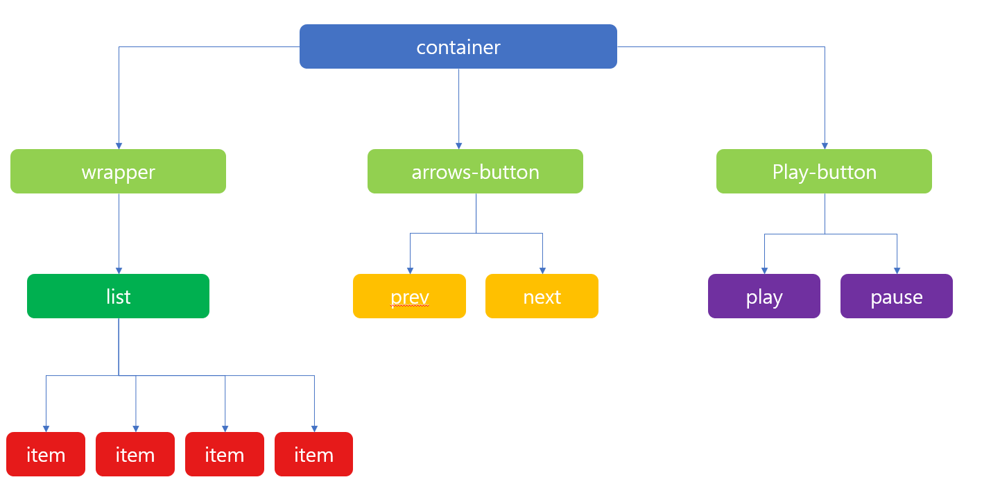
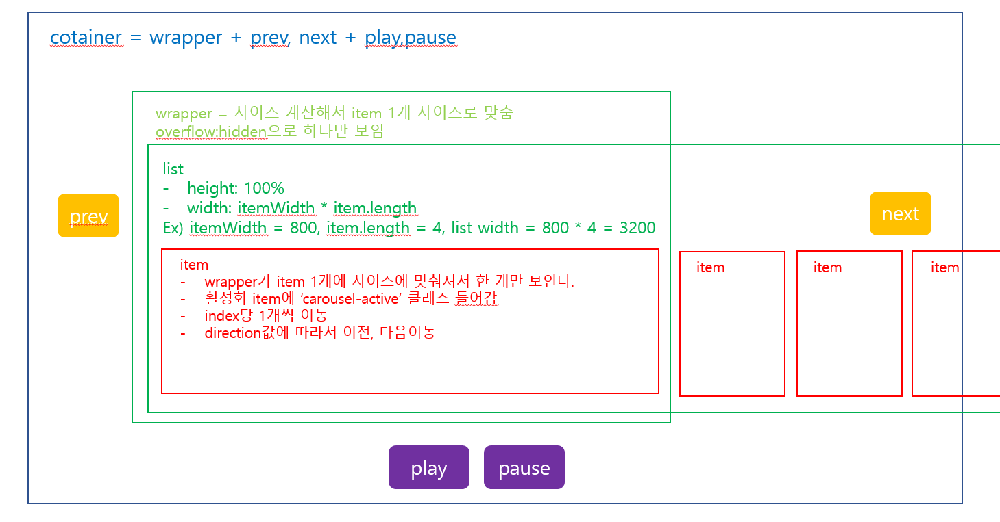

# Carousel-js

# 생성방법
``` javascript
    const slide = carousel({
        selector: '#carousel', // container id값
        speed: 500, // 
        space: 0, // item간 간격(구현x)
        initialindex: 0, // 시작 index값
        autoplay: true, // autoplay
        timer: 2000, // autoplay 시간
        rtl: true, // 슬라이드 방향설정
    });
```

# Carousel 요구사항

- [x] HTML/CSS

- [x] 한개의 아이템이 노출

- [x] 좌/우 버튼이 눌리면 좌우 아이템이 노출

- [x] 아이템이 이동시 슬라이딩 되는 느낌으로 진행

- [x] 좌우 루프

- [x] 자동재생(정지/시작)

- [x] 재생 타이머

- [x] 이동 속도(transition speed)

# 설계도


